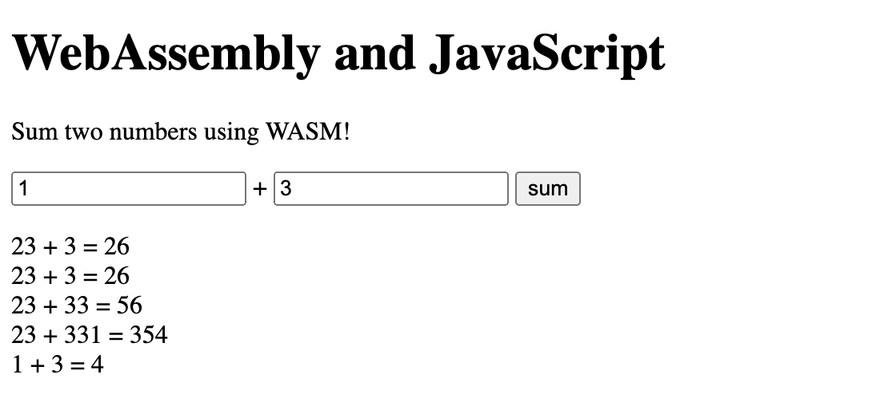

# WASM: Go + JS Demo

This is a very simple demo of generating webassembly bytecode using the Go programming language and running the said bytecode in a browser and in a shell via wasmtime. The Go source code constitutes a simple sum-function that takes two numbers as arguments and returns their sum.



## Building the target

You can build the browser and WASI targets by running `make`. The build commands are already specified in the Makefile. If you don't have `make` installed, you can build the targets by running the two commands below:

```sh
# for wasmtime
GOOS=wasip1 GOARCH=wasm go build -o wasi/app.wasm wasi/main.go
# for browser
GOOS=js GOARCH=wasm go build -o web/browser.wasm main.go
```

## Running the wasi target

You can run the wasi target directly on your machine using wasmtime. You must have wasmtime already installed and available on your shell's path. If you don't have wasmtime already, you can install it from the [official website](https://wasmtime.dev/) and then run it like so:

```sh
wasmtime wasi/app.wasm
```

Expected output:

```
╰─$ wasmtime wasi/app.wasm
Hello Golang!
Pass two numbers to sum
```

## Running the browser demo

The web directory of this repo contains HTML, JavaScript, and the wasm binary necessary for the browser demo. The main JavaScript file (index.js) loads wasm binary (browser.wasm) with the help of the the `wasm_exec.js` library provided by the Go team. You can run the browser demo by serving the content of the `web` directory. Here's a sample command to achieve this using Python's http.server:

```sh
python3 -m http.server -d web 4500
```

This runs the app (shown on the initial screenshot) on port 4500 on all interfaces (0.0.0.0).
