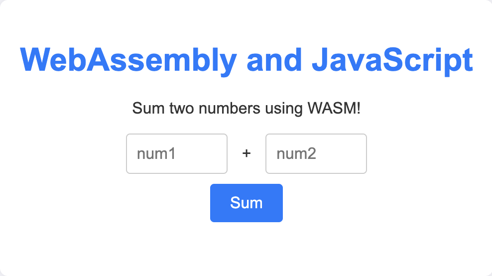

# WASM:Golang + JS Demo

This is a very simple demo of using Golang to generate WebAssembly and then using it on the browser. The Go code is a simple sum function.



## Building the target

You can build the browser and WASI targets by running make. All specifics are in the Makefile. If you don't have make installed, you can use the following commands:

```sh
GOOS=wasip1 GOARCH=wasm go build -o wasi/app.wasm wasi/main.go
GOOS=js GOARCH=wasm go build -o web/browser.wasm main.go
```

## Running the wasi target

You can run the wasi target directly on your machine using wasmtime. Install it from the [official website](https://wasmtime.dev/) and then run it like so:

```sh
wasmtime wasi/app.wasm
```

Sample output:

```
╰─$ wasmtime wasi/app.wasm
Hello Golang!
Pass two numbers to sum
```

## Running the browser target

You can run the browser target by serving the content in the web directory using your favourite static file server. Here's a command that uses Python's http.server:

```sh
python3 -m http.server -d web 4500
```

This runs the app on port 4500 on all interfaces.
